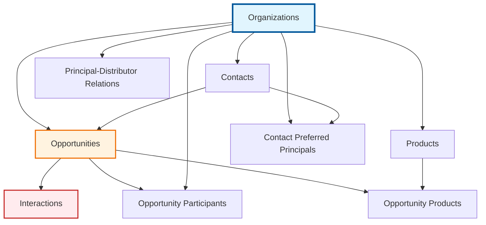

# Entity Schema Dependencies Analysis for Yup-to-Zod Migration

Comprehensive analysis of entity relationships, schema dependencies, and migration strategy for transitioning from Yup to Zod validation schemas in the KitchenPantry CRM system.

## Overview

This analysis examines the interdependencies between entity schemas, database relationships, and form validation patterns to establish a safe migration order that minimizes risk and maintains system integrity during the Yup-to-Zod transition.

## Relevant Files

- `/src/lib/database.types.ts`: Complete database schema with relationships and constraints
- `/src/types/organization.types.ts`: Organization validation schema and form types (Yup-based)
- `/src/types/contact.types.ts`: Contact validation schema with cross-entity dependencies (Yup-based)
- `/src/types/opportunity.types.ts`: Opportunity validation schema with complex relationships (Yup-based)
- `/src/types/interaction.types.ts`: Interaction validation schema with highest dependency chain (Yup-based)
- `/src/types/product-extensions.ts`: Product type extensions and display patterns
- `/src/pages/*.schema.ts`: Layout schema configurations (already using some Zod)
- `/src/components/forms/CRMFormSchemas.tsx`: Existing Zod patterns for form generation
- `/src/lib/layout/validation.ts`: Layout validation using Zod patterns

## Entity Dependency Graph



## Database Relationship Mapping

### Primary Relationships (Foreign Key Dependencies)

1. **Organizations (Root Entity)**
   - Self-referencing: `parent_organization_id` → `organizations.id`
   - Manager references: `primary_manager_id`, `secondary_manager_id` → `contacts.id`

2. **Contacts → Organizations**
   - **Dependency**: `organization_id` → `organizations.id` (NOT NULL)
   - **Risk Level**: Medium (nullable in forms but required in database)

3. **Products → Organizations**
   - **Dependency**: `principal_id` → `organizations.id` (NOT NULL)
   - **Risk Level**: Low (independent validation)

4. **Opportunities → Multiple Entities**
   - **Dependencies**:
     - `organization_id` → `organizations.id` (NOT NULL)
     - `contact_id` → `contacts.id` (nullable)
     - `principal_organization_id` → `organizations.id` (nullable)
     - `distributor_organization_id` → `organizations.id` (nullable)
   - **Risk Level**: High (complex cross-entity validation)

5. **Interactions → Opportunities**
   - **Dependency**: `opportunity_id` → `opportunities.id` (NOT NULL)
   - **Additional**: `contact_id`, `organization_id` (nullable but validated)
   - **Risk Level**: Critical (highest dependency chain)

### Secondary Relationships (Junction Tables)

- **Contact Preferred Principals**: `contact_id` + `principal_organization_id`
- **Opportunity Participants**: `opportunity_id` + `organization_id`
- **Opportunity Products**: `opportunity_id` + `product_id`
- **Principal Distributor Relationships**: `principal_id` + `distributor_id`

## Form Interdependencies & Cross-Entity Validation

### Complex Validation Patterns

1. **Contact Forms with Organization Creation**
   ```typescript
   // Current Yup pattern in contact.types.ts
   organization_mode: 'existing' | 'new'
   organization_name: string (required when mode='new')
   organization_type: required when creating new org
   ```

2. **Opportunity Forms with Multiple Principals**
   ```typescript
   // Multi-principal creation from opportunity.types.ts
   principals: string[] (min 1 required)
   auto_generated_name: boolean
   opportunity_context: required for auto-naming
   ```

3. **Interaction Forms with Opportunity Creation**
   ```typescript
   // Opportunity creation embedded in interaction.types.ts
   create_opportunity: boolean
   opportunity_name: required when create_opportunity=true
   opportunity_stage: required when creating opportunity
   ```

### Form Transform Dependencies

All entities use `FormTransforms` utility functions:
- `nullableString` - Transform empty strings to null
- `nullableEmail` - Email validation with null handling
- `nullablePhone` - Phone number formatting
- `nullableUrl` - URL validation
- `uuidField` - UUID validation with null handling
- `optionalArray` - Array field handling

## Migration Order Recommendations

### Phase 1: Foundation (Low Risk) - Organizations & Products
**Order**: Organizations → Products
**Rationale**: Organizations is root entity; Products have simple dependencies
**Estimated Duration**: 2-3 weeks

#### Organizations Migration
- **Risk Assessment**: LOW ✅
- **Dependencies**: Minimal (self-referencing only)
- **Form Complexity**: Moderate (address fields, type validation)
- **Test Strategy**: Unit tests for schema, integration tests for form submission

#### Products Migration
- **Risk Assessment**: LOW ✅
- **Dependencies**: Only depends on Organizations (via principal_id)
- **Form Complexity**: Low (enum-based category, pricing fields)
- **Test Strategy**: Schema validation, principal relationship validation

### Phase 2: User-Facing Entities (Medium Risk) - Contacts
**Order**: Contacts (after Organizations complete)
**Rationale**: Dependent on Organizations; has cross-entity creation logic
**Estimated Duration**: 3-4 weeks

#### Contacts Migration
- **Risk Assessment**: MEDIUM ⚠️
- **Dependencies**: Organizations (required), cross-entity organization creation
- **Form Complexity**: HIGH (organization_mode logic, preferred principals)
- **Critical Patterns**:
  ```typescript
  // Complex conditional validation
  organization_name.when('organization_mode', {
    is: 'new',
    then: required('Organization name required when creating new org')
  })
  ```
- **Test Strategy**: Complex conditional validation testing, organization creation flows

### Phase 3: Business Logic Entities (High Risk) - Opportunities
**Order**: Opportunities (after Contacts complete)
**Rationale**: Complex multi-entity dependencies, critical business logic
**Estimated Duration**: 4-5 weeks

#### Opportunities Migration
- **Risk Assessment**: HIGH ⚡
- **Dependencies**: Organizations, Contacts, multi-principal logic
- **Form Complexity**: CRITICAL (auto-naming, stage progression, multiple principals)
- **Critical Patterns**:
  ```typescript
  // Multi-principal opportunity creation
  multiPrincipalOpportunitySchema with auto-naming logic
  generateOpportunityName() utility integration
  Stage progression validation with OPPORTUNITY_STAGE_ORDER
  ```
- **Test Strategy**: Complex business logic validation, multi-entity relationship testing, stage progression validation

### Phase 4: Integration Layer (Critical Risk) - Interactions
**Order**: Interactions (final phase)
**Rationale**: Highest dependency chain, can create Opportunities dynamically
**Estimated Duration**: 5-6 weeks

#### Interactions Migration
- **Risk Assessment**: CRITICAL 🔥
- **Dependencies**: All other entities, embedded opportunity creation
- **Form Complexity**: MAXIMUM (opportunity creation, priority mapping, principal tracking)
- **Critical Patterns**:
  ```typescript
  // Dynamic opportunity creation within interaction
  interactionWithOpportunitySchema
  Mobile templates with MOBILE_INTERACTION_TEMPLATES
  Priority color mapping integration
  Account manager validation
  ```
- **Test Strategy**: End-to-end validation, embedded opportunity creation, mobile template validation

## Testing Strategy for Each Entity

### Comprehensive Testing Approach

1. **Schema Migration Testing**
   - Yup-to-Zod schema equivalence validation
   - Transform function compatibility testing
   - Edge case validation (null handling, conditional logic)

2. **Form Integration Testing**
   - React Hook Form integration with new Zod schemas
   - Cross-entity validation flows
   - Error message consistency

3. **Database Constraint Testing**
   - Foreign key relationship validation
   - NOT NULL constraint enforcement
   - Enum value validation against database

4. **Business Logic Testing**
   - Auto-naming algorithms (opportunities)
   - Stage progression logic
   - Priority calculations and mappings

### Entity-Specific Test Requirements

#### Organizations
- **Schema Tests**: Address validation, type enums, priority levels
- **Business Logic**: Food service segment validation, principal/distributor flags
- **Integration**: Manager assignment validation

#### Products
- **Schema Tests**: Category enums, pricing validation, principal relationships
- **Business Logic**: Inventory status calculations, seasonal date validation
- **Integration**: Principal organization validation

#### Contacts
- **Schema Tests**: Role enums, authority levels, purchase influence
- **Business Logic**: Organization creation logic, preferred principals
- **Integration**: Cross-entity organization creation workflows
- **Complex Scenarios**: New organization creation with validation chains

#### Opportunities
- **Schema Tests**: Stage/status enums, probability ranges, value validation
- **Business Logic**: Auto-naming generation, multi-principal creation, stage progression
- **Integration**: Contact/organization relationship validation
- **Complex Scenarios**: Multi-principal opportunity creation workflows

#### Interactions
- **Schema Tests**: Type enums, priority validation, date handling
- **Business Logic**: Embedded opportunity creation, mobile templates, account manager validation
- **Integration**: Full entity relationship chain validation
- **Complex Scenarios**: Dynamic opportunity creation from interaction forms

## Risk Assessment Per Entity

### Risk Matrix

| Entity | Migration Complexity | Dependency Risk | Business Logic Risk | Form Integration Risk | Overall Risk |
|--------|---------------------|-----------------|--------------------|-----------------------|--------------|
| Organizations | LOW | LOW | LOW | MEDIUM | **LOW** ✅ |
| Products | LOW | LOW | LOW | LOW | **LOW** ✅ |
| Contacts | MEDIUM | MEDIUM | MEDIUM | HIGH | **MEDIUM** ⚠️ |
| Opportunities | HIGH | HIGH | CRITICAL | CRITICAL | **HIGH** ⚡ |
| Interactions | CRITICAL | CRITICAL | CRITICAL | CRITICAL | **CRITICAL** 🔥 |

### Risk Mitigation Strategies

1. **Gradual Migration Approach**
   - Maintain Yup schemas alongside Zod during transition
   - Feature flag new validations for gradual rollout
   - Extensive A/B testing between validation systems

2. **Comprehensive Testing**
   - 100% test coverage for all schema migrations
   - Integration tests for cross-entity validation
   - End-to-end testing for complex workflows

3. **Rollback Strategy**
   - Maintain backward compatibility during transition
   - Database constraints as safety net for validation
   - Monitoring and alerting for validation failures

## Implementation Timeline

### Phase 1: Organizations & Products (Weeks 1-4)
- Week 1-2: Organizations schema migration and testing
- Week 3-4: Products schema migration and testing
- Milestone: Foundation entities validated with Zod

### Phase 2: Contacts (Weeks 5-8)
- Week 5-6: Contacts schema migration with organization creation logic
- Week 7-8: Complex conditional validation and testing
- Milestone: User-facing entities migrated

### Phase 3: Opportunities (Weeks 9-13)
- Week 9-10: Basic opportunity schema migration
- Week 11-12: Multi-principal logic and auto-naming
- Week 13: Stage progression and business logic validation
- Milestone: Core business entities migrated

### Phase 4: Interactions (Weeks 14-19)
- Week 14-15: Basic interaction schema migration
- Week 16-17: Embedded opportunity creation logic
- Week 18-19: Mobile templates and complete integration testing
- Milestone: Full system migration complete

### Phase 5: Cleanup & Optimization (Weeks 20-21)
- Remove Yup dependencies
- Optimize Zod schema performance
- Documentation and knowledge transfer

## Success Criteria

1. **Functional Equivalence**: All existing form validations work identically with Zod
2. **Performance Maintenance**: No degradation in form validation performance
3. **Type Safety Enhancement**: Improved TypeScript inference with Zod schemas
4. **Developer Experience**: Simpler schema definitions and better error messages
5. **Test Coverage**: 100% test coverage maintained throughout migration
6. **Zero Regressions**: No functional regressions in form behavior or validation

## Monitoring & Validation

- **Schema Validation Metrics**: Track validation success/failure rates
- **Form Submission Analytics**: Monitor form completion rates during transition
- **Error Rate Monitoring**: Alert on increased validation errors
- **Performance Monitoring**: Track form validation timing
- **User Experience Metrics**: Monitor support tickets related to form issues

## Conclusion

The migration from Yup to Zod should follow the dependency order: Organizations → Products → Contacts → Opportunities → Interactions. This approach minimizes risk by migrating foundation entities first and building up through the dependency chain. The most critical phase will be Interactions due to its complex cross-entity validation and embedded opportunity creation logic.

Key success factors:
- Maintain comprehensive testing throughout migration
- Implement gradual rollout with feature flags
- Preserve all existing validation logic and business rules
- Monitor closely for regressions during transition
- Maintain backward compatibility until migration is complete