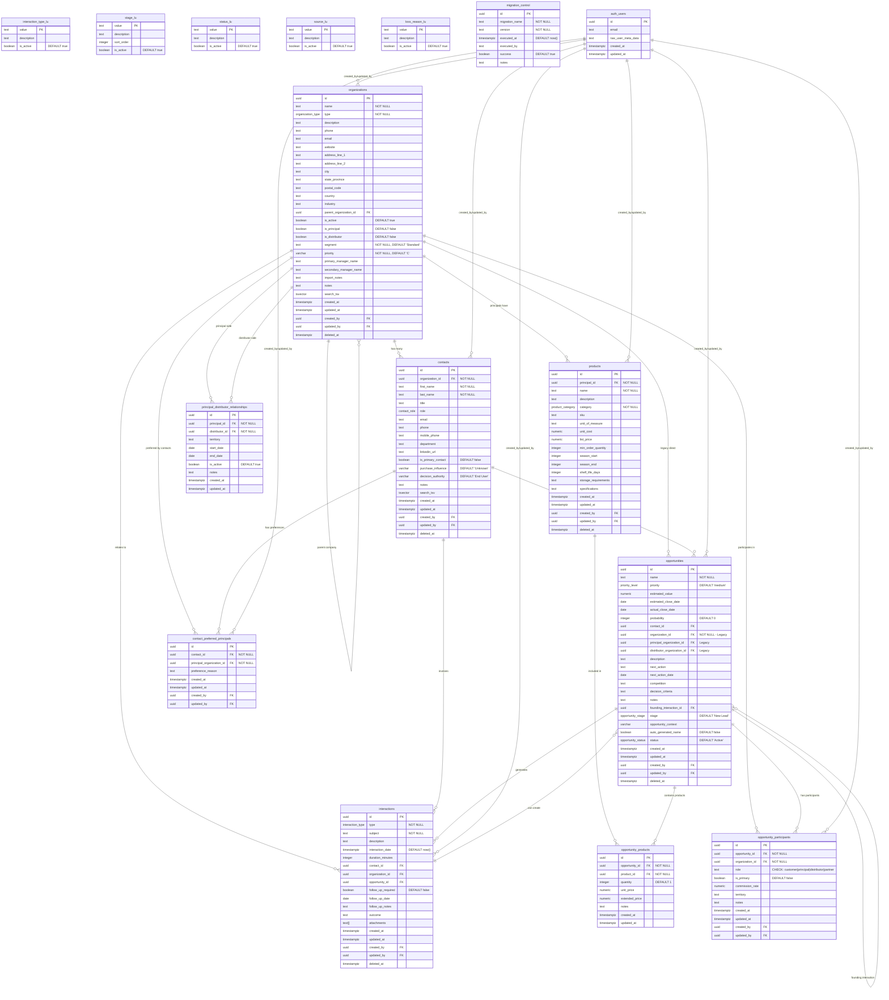

# KitchenPantry CRM - Entity Relationship Diagram (ERD)

**Version:** 1.0 MVP  
**Database:** PostgreSQL 17.4 (Supabase)  
**Last Updated:** January 2025  
**Project ID:** ixitjldcdvbazvjsnkao

---

## Overview

This Entity Relationship Diagram (ERD) represents the complete database schema for the KitchenPantry CRM system, specifically designed for the food service industry. The database focuses on managing complex relationships between principals (manufacturers), distributors, and customers in the food service supply chain.

## Core Design Principles

- **UUID Primary Keys**: All tables use UUIDs for global uniqueness and security
- **Soft Deletes**: Data preservation through `deleted_at` timestamps
- **Full Audit Trail**: `created_at`, `updated_at`, `created_by`, `updated_by` on all tables
- **Row Level Security (RLS)**: Fine-grained access control at database level
- **Full-Text Search**: `search_tsv` columns for advanced search capabilities

---

## Entity Relationship Diagram

---

## Entity Details

### Core Entities

#### 1. **organizations** (Central Hub)
**Purpose**: Represents all companies in the CRM system - principals, distributors, customers, prospects, and vendors.

**Key Features**:
- **Multi-type support**: Single table handles all organization types
- **Business classification**: Segment (Fine Dining, Healthcare, etc.) and Priority (A-D)
- **Hierarchical support**: Parent-child relationships via `parent_organization_id`
- **Excel import compatibility**: Manager name fields and import notes
- **Full-text search**: Optimized search capabilities

#### 2. **contacts** (People)
**Purpose**: Individual people within organizations, representing all human relationships.

**Key Features**:
- **Decision-making context**: Purchase influence and decision authority fields
- **Contact preferences**: Primary contact designation per organization
- **Professional context**: Title, department, role information
- **Multiple contact methods**: Phone, mobile, email, LinkedIn

#### 3. **products** (Catalog)
**Purpose**: Products offered by principal organizations in the food service industry.

**Key Features**:
- **Principal-only**: Only principal organizations can have products
- **Seasonal support**: Start/end months for seasonal products
- **Commercial details**: Pricing, minimum orders, units of measure
- **Food service specific**: Categories like Beverages, Dairy, Meat & Poultry

#### 4. **opportunities** (Sales Pipeline)
**Purpose**: Sales opportunities and deals tracking the complete sales process.

**Key Features**:
- **Dual relationship model**: Legacy direct relationships + new participant model
- **7-stage sales funnel**: From "New Lead" to "Closed Won/Lost"
- **Financial tracking**: Estimated value, probability, close dates
- **Context tracking**: How opportunity originated (trade show, site visit, etc.)

#### 5. **interactions** (Activity History)
**Purpose**: Complete communication and activity history for relationship management.

**Key Features**:
- **Flexible linking**: Can connect to contacts, organizations, and/or opportunities
- **Rich context**: Type, duration, outcome, attachments
- **Follow-up management**: Built-in reminder system
- **Opportunity genesis**: Can create opportunities from interactions

---

## Junction Tables (Many-to-Many Relationships)

### **opportunity_products**
Links opportunities to specific products with quantities and pricing.

### **opportunity_participants** (Modern Pattern)
Maps organizations to opportunities with specific roles (customer, principal, distributor, partner).
**Note**: This is the preferred pattern over legacy direct foreign keys in opportunities table.

### **contact_preferred_principals**
Tracks which principals each contact advocates for or prefers to work with.

### **principal_distributor_relationships**
Manages distribution agreements and territory assignments between principals and distributors.

---

## Lookup Tables (Reference Data)

- **interaction_type_lu**: Call, Email, Meeting, Demo, etc.
- **stage_lu**: Opportunity stages in sales funnel
- **status_lu**: Record status values
- **source_lu**: Lead source tracking
- **loss_reason_lu**: Why opportunities are lost

---

## Business Logic & Constraints

### **Data Integrity**
- **UUID Primary Keys**: All tables use UUIDs for security and global uniqueness
- **Foreign Key Constraints**: Maintain referential integrity
- **Check Constraints**: Validate business rules (priority A-D, probability 0-100)
- **Unique Constraints**: Prevent duplicates where appropriate

### **Soft Delete Pattern**
- All core entities support soft deletes via `deleted_at`
- Queries must include `WHERE deleted_at IS NULL` for active records
- Preserves data for audit and recovery purposes

### **Row Level Security (RLS)**
- Comprehensive policies on all tables
- User-based and organization-based access control
- Admin override capabilities
- Helper functions: `user_is_admin()`, `user_has_org_access()`

### **Full-Text Search**
- `search_tsv` columns on searchable entities
- Trigram indexing for fuzzy matching
- Optimized for name and content searches

---

## Food Service Industry Specifics

### **Organization Types**
- **Principal**: Manufacturers/suppliers (have products)
- **Distributor**: Distribution companies (connect principals to customers)  
- **Customer**: End customers (restaurants, institutions)
- **Prospect**: Potential customers
- **Vendor**: Service providers

### **Business Segments**
Fine Dining, Fast Food, Fast Casual, Healthcare, Education, Corporate Catering, Hotel & Resort, Entertainment Venue, Retail Food Service, Government, Senior Living

### **Product Categories**
Beverages, Dairy, Meat & Poultry, Seafood, Produce, Frozen Foods, Dry Goods, Condiments & Sauces, Bakery, Other

### **Sales Process**
7-stage funnel optimized for food service industry sales cycles:
New Lead → Initial Outreach → Qualified → Demo/Sampling → Proposal → Negotiation → Closed Won/Lost

---

## Performance Optimizations

### **Strategic Indexing**
- Primary keys (UUID) with B-tree indexes
- Foreign keys indexed for JOIN performance
- Composite indexes for common query patterns
- GIN indexes for full-text search
- Partial indexes for soft-deleted records

### **Query Patterns**
- Dashboard metrics aggregations
- Pipeline reporting by stage
- Activity feeds with time-based sorting
- Multi-criteria filtering and search

---

## Migration & Evolution Notes

### **Current State (January 2025)**
- **Opportunities table**: In transition from direct foreign keys to participant model
- **Excel import fields**: Added for data migration compatibility
- **Full-text search**: Recently optimized with trigram indexes

### **Future Considerations**
- Legacy opportunity foreign keys can be removed once UI fully adopts participant model
- Manager name fields may be converted to proper foreign keys
- Additional lookup tables may be added for extended categorization

---

**Database Schema Confidence: 95%** ✅

*This ERD represents the production-ready database design for the KitchenPantry CRM MVP, validated through comprehensive testing and optimized for the food service industry.*