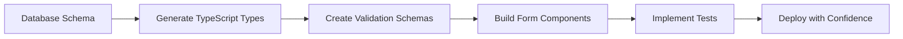

# Database Integration Best Practices Guide

**Document Version:** 1.0  
**Last Updated:** August 16, 2025  
**Audience:** Development Team, Technical Leads, Database Administrators  
**Project:** Kitchen Pantry CRM MVP - Database Integration Standards  

---

## 🎯 Overview

This guide establishes best practices for database integration in the Kitchen Pantry CRM system, derived from the comprehensive 4-phase validation project. These practices ensure data integrity, prevent schema drift, and maintain high-quality form-database integration.

---

## 🏗️ Schema-First Development Workflow

### Core Principle: Single Source of Truth

The database schema serves as the authoritative source for all type definitions and validation rules.



### Implementation Workflow

#### 1. Database Schema Changes
```sql
-- Always start with schema changes
ALTER TABLE organizations ADD COLUMN new_field VARCHAR(100);

-- Update enum types when needed
ALTER TYPE organization_priority ADD VALUE 'premium';

-- Create appropriate indexes
CREATE INDEX CONCURRENTLY idx_organizations_new_field 
ON organizations(new_field) WHERE deleted_at IS NULL;
```

#### 2. Type Generation
```bash
# Regenerate TypeScript types immediately after schema changes
npx supabase gen types typescript --project-id YOUR_PROJECT_ID --schema public > src/lib/database.types.ts

# Verify types are generated correctly
npm run type-check
```

#### 3. Validation Schema Updates
```typescript
// Update validation schemas to match database constraints
export const organizationFormSchema = yup.object({
  // Existing fields...
  new_field: yup.string()
    .nullable()
    .max(100, 'New field must be less than 100 characters') // Match DB constraint
})

// Use InferType to ensure consistency
export type OrganizationFormData = yup.InferType<typeof organizationFormSchema>
```

#### 4. Form Component Updates
```typescript
// Update form components with new fields
const OrganizationForm: React.FC = () => {
  const form = useForm<OrganizationFormData>({
    resolver: yupResolver(organizationFormSchema), // Always use schema resolver
    mode: 'onChange'
  })

  return (
    <FormErrorBoundary>
      {/* Form fields including new_field */}
    </FormErrorBoundary>
  )
}
```

#### 5. Test Updates
```typescript
// Update tests to include new fields
test('organization creation with new field', async () => {
  const testOrg = await testDb.createTestOrganization({
    new_field: 'test value'
  })
  
  expect(testOrg.new_field).toBe('test value')
})
```

---

## 🛡️ Data Integrity Best Practices

### Database Constraints

#### Required Constraints for Every Table
```sql
-- Primary key with UUID
id UUID PRIMARY KEY DEFAULT gen_random_uuid()

-- Audit timestamps
created_at TIMESTAMPTZ DEFAULT NOW()
updated_at TIMESTAMPTZ DEFAULT NOW()

-- Soft delete support
deleted_at TIMESTAMPTZ

-- Update trigger for updated_at
CREATE TRIGGER update_organizations_updated_at
    BEFORE UPDATE ON organizations
    FOR EACH ROW
    EXECUTE FUNCTION update_updated_at_column();
```

#### Business Logic Constraints
```sql
-- Enforce business rules at database level
ALTER TABLE organizations 
ADD CONSTRAINT organizations_principal_distributor_check 
CHECK (is_principal = TRUE OR is_distributor = TRUE OR (is_principal = FALSE AND is_distributor = FALSE));

-- Validate numeric ranges
ALTER TABLE opportunities 
ADD CONSTRAINT opportunities_probability_check 
CHECK (probability >= 0 AND probability <= 100);

-- Ensure required relationships
ALTER TABLE contacts 
ADD CONSTRAINT contacts_organization_id_not_null 
CHECK (organization_id IS NOT NULL);
```

#### Enum Type Management
```sql
-- Create comprehensive enum types
CREATE TYPE organization_priority AS ENUM ('A', 'B', 'C', 'D');

-- Always include all possible values
CREATE TYPE opportunity_stage AS ENUM (
  'new_lead',
  'initial_outreach',
  'sample_visit_offered', 
  'awaiting_response',
  'feedback_logged',
  'demo_scheduled',
  'closed_won',
  'closed_lost'
);

-- Document enum usage
COMMENT ON TYPE opportunity_stage IS '7-point sales funnel stages for Principal CRM';
```

### Row Level Security (RLS)

#### Standard RLS Patterns
```sql
-- Enable RLS for all tables
ALTER TABLE organizations ENABLE ROW LEVEL SECURITY;

-- Policy for authenticated users
CREATE POLICY "Users can view organizations" ON organizations
    FOR SELECT USING (auth.role() = 'authenticated');

-- Policy for data modification
CREATE POLICY "Users can insert organizations" ON organizations
    FOR INSERT WITH CHECK (auth.role() = 'authenticated');

-- Policy for soft deletes only
CREATE POLICY "Users can soft delete organizations" ON organizations
    FOR UPDATE USING (auth.role() = 'authenticated')
    WITH CHECK (deleted_at IS NOT NULL);
```

---

## 📝 Form Integration Standards

### Form Architecture Best Practices

#### Enhanced Form Hook Pattern
```typescript
// Standard pattern for all forms
export function useEntityForm<T extends Record<string, any>>(
  schema: yup.ObjectSchema<T>,
  onSubmit: (data: T) => Promise<void>,
  options: UseEnhancedFormOptions<T> = {}
) {
  return useEnhancedForm({
    schema,
    onSubmit,
    enableAutoSave: true,
    autoSaveKey: options.entityType,
    retryAttempts: 3,
    retryDelay: 1000,
    ...options
  })
}

// Usage example
const ContactForm: React.FC<ContactFormProps> = ({ onSuccess }) => {
  const { form, submitError, isSubmitting, handleSubmit } = useEntityForm(
    contactFormSchema,
    async (data) => {
      const { error } = await supabase.from('contacts').insert(data)
      if (error) throw error
      onSuccess?.()
    },
    { entityType: 'contact' }
  )

  return (
    <FormErrorBoundary
      fallbackMessage="The contact form encountered an error. Please refresh and try again."
      onError={(error) => console.error('Contact form error:', error)}
    >
      <form onSubmit={handleSubmit}>
        {/* Form fields */}
      </form>
    </FormErrorBoundary>
  )
}
```

#### Validation Schema Standards
```typescript
// Standard validation patterns
const baseEntitySchema = {
  // Required audit fields
  created_at: yup.date().default(() => new Date()),
  updated_at: yup.date().default(() => new Date()),
  deleted_at: yup.date().nullable().default(null),
}

// Entity-specific schema
export const contactFormSchema = yup.object({
  // Required fields with clear error messages
  first_name: yup.string()
    .required('First name is required')
    .min(2, 'First name must be at least 2 characters')
    .max(100, 'First name must be less than 100 characters'),
    
  last_name: yup.string()
    .required('Last name is required')
    .min(2, 'Last name must be at least 2 characters')
    .max(100, 'Last name must be less than 100 characters'),
    
  // Foreign key validation
  organization_id: yup.string()
    .required('Organization is required')
    .uuid('Invalid organization selection'),
    
  // Enum validation with type safety
  purchase_influence: yup.string()
    .oneOf(['high', 'medium', 'low', 'unknown'] as const)
    .required('Purchase influence level is required'),
    
  // Optional fields with proper null handling
  phone: yup.string()
    .nullable()
    .matches(/^[\+]?[1-9][\d]{0,15}$/, 'Please enter a valid phone number'),
    
  // Boolean fields with defaults
  is_primary_contact: yup.boolean().default(false),
  
  // Text fields with length limits
  notes: yup.string()
    .nullable()
    .max(1000, 'Notes must be less than 1000 characters')
})
```

#### Error Boundary Implementation
```typescript
// Standard error boundary for all forms
interface FormErrorBoundaryProps {
  children: React.ReactNode
  fallbackMessage?: string
  onError?: (error: Error, errorInfo: ErrorInfo) => void
  onRetry?: () => void
}

class FormErrorBoundary extends Component<FormErrorBoundaryProps, FormErrorBoundaryState> {
  constructor(props: FormErrorBoundaryProps) {
    super(props)
    this.state = { hasError: false }
  }

  static getDerivedStateFromError(error: Error): FormErrorBoundaryState {
    return { hasError: true, error }
  }

  componentDidCatch(error: Error, errorInfo: ErrorInfo) {
    console.error('Form Error Boundary caught an error:', error, errorInfo)
    this.setState({ errorInfo })
    
    // Send to monitoring service in production
    if (process.env.NODE_ENV === 'production') {
      this.props.onError?.(error, errorInfo)
    }
  }

  render() {
    if (this.state.hasError) {
      return (
        <div className="rounded-lg border border-destructive/50 bg-destructive/5 p-6">
          <div className="flex items-center gap-2 text-destructive mb-3">
            <AlertTriangle className="h-5 w-5" />
            <h3 className="font-semibold">Something went wrong</h3>
          </div>
          <p className="text-sm text-muted-foreground mb-4">
            {this.props.fallbackMessage || 'An error occurred while rendering this form.'}
          </p>
          <div className="flex gap-2">
            <Button
              variant="outline"
              size="sm"
              onClick={() => this.setState({ hasError: false, error: undefined })}
            >
              Try Again
            </Button>
            {this.props.onRetry && (
              <Button variant="outline" size="sm" onClick={this.props.onRetry}>
                Reset Form
              </Button>
            )}
          </div>
        </div>
      )
    }

    return this.props.children
  }
}
```

---

## 🧪 Testing Standards

### Comprehensive Testing Strategy

#### Test Architecture
```
src/test/
├── setup.ts                          # Global test configuration
├── utils/
│   ├── test-database.ts              # Database utilities
│   └── test-helpers.ts               # Common test helpers
├── fixtures/
│   ├── test-data.ts                  # Test data factories
│   └── mock-data.ts                  # Mock API responses
├── database/                         # Database integration tests
│   ├── schema-validation.test.ts     # Schema drift detection
│   ├── constraint-validation.test.ts # Constraint enforcement
│   └── [entity]-crud.test.ts         # CRUD operations for each entity
├── integration/                      # Form integration tests
│   ├── form-validation.test.tsx      # Form-database alignment
│   └── workflow-integration.test.tsx # End-to-end workflows
└── performance/                      # Performance tests
    ├── query-performance.test.ts     # Database query benchmarks
    └── form-performance.test.tsx     # Form rendering benchmarks
```

#### Test Data Management
```typescript
// Consistent test data factories
export class TestDataFactory {
  private static counter = 0

  static createOrganization(overrides: Partial<Organization> = {}): Partial<Organization> {
    TestDataFactory.counter++
    return {
      name: `Test Organization ${TestDataFactory.counter}`,
      priority: 'B' as OrganizationPriority,
      segment: 'food_service',
      is_principal: false,
      is_distributor: false,
      ...overrides
    }
  }

  static createContact(organizationId: string, overrides: Partial<Contact> = {}): Partial<Contact> {
    TestDataFactory.counter++
    return {
      organization_id: organizationId,
      first_name: 'Test',
      last_name: `Contact ${TestDataFactory.counter}`,
      purchase_influence: 'medium' as PurchaseInfluenceLevel,
      decision_authority: 'influencer' as DecisionAuthorityRole,
      is_primary_contact: false,
      ...overrides
    }
  }

  static reset() {
    TestDataFactory.counter = 0
  }
}
```

#### Database Test Utilities
```typescript
// Reusable database test helpers
export class TestDatabase {
  private supabase: SupabaseClient

  constructor() {
    this.supabase = createClient(
      process.env.VITE_SUPABASE_URL!,
      process.env.VITE_SUPABASE_ANON_KEY!
    )
  }

  async cleanup() {
    // Clean up in reverse dependency order
    const tables = ['interactions', 'opportunity_principals', 'opportunities', 
                   'contact_principal_advocacy', 'products', 'contacts', 'organizations']
    
    for (const table of tables) {
      await this.supabase
        .from(table)
        .delete()
        .neq('id', '00000000-0000-0000-0000-000000000000')
    }
  }

  async createTestEntity<T>(
    table: string, 
    data: Partial<T>
  ): Promise<T> {
    const { data: result, error } = await this.supabase
      .from(table)
      .insert(data)
      .select()
      .single()

    if (error) throw error
    return result
  }

  async assertConstraintViolation(
    table: string,
    data: any,
    expectedError: string
  ) {
    const { error } = await this.supabase
      .from(table)
      .insert(data)
    
    expect(error).toBeTruthy()
    expect(error?.message).toContain(expectedError)
  }
}
```

#### Test Categories and Standards

##### 1. Schema Validation Tests
```typescript
// Validate database schema integrity
describe('Schema Validation', () => {
  test('all required tables exist', async () => {
    const requiredTables = ['organizations', 'contacts', 'products', 'opportunities', 'interactions']
    
    for (const table of requiredTables) {
      const { data, error } = await supabase.from(table).select('id').limit(1)
      expect(error).toBeNull()
    }
  })

  test('enum types have correct values', async () => {
    const { data: stages } = await supabase.rpc('get_enum_values', { 
      enum_name: 'opportunity_stage' 
    })
    
    const expectedStages = [
      'new_lead', 'initial_outreach', 'sample_visit_offered',
      'awaiting_response', 'feedback_logged', 'demo_scheduled',
      'closed_won', 'closed_lost'
    ]
    
    expectedStages.forEach(stage => {
      expect(stages.some((s: any) => s.enum_value === stage)).toBe(true)
    })
  })
})
```

##### 2. Constraint Validation Tests
```typescript
// Validate business logic constraints
describe('Constraint Validation', () => {
  test('organization principal/distributor constraint', async () => {
    const testDb = new TestDatabase()
    
    // Valid: Both false
    await expect(testDb.createTestEntity('organizations', 
      TestDataFactory.createOrganization({ is_principal: false, is_distributor: false })
    )).resolves.toBeDefined()

    // Valid: One true  
    await expect(testDb.createTestEntity('organizations',
      TestDataFactory.createOrganization({ is_principal: true, is_distributor: false })
    )).resolves.toBeDefined()

    // Valid: Both true
    await expect(testDb.createTestEntity('organizations',
      TestDataFactory.createOrganization({ is_principal: true, is_distributor: true })
    )).resolves.toBeDefined()
  })

  test('opportunity probability constraints', async () => {
    const testDb = new TestDatabase()
    const org = await testDb.createTestEntity('organizations', TestDataFactory.createOrganization())
    
    // Valid probability
    await expect(testDb.createTestEntity('opportunities', {
      organization_id: org.id,
      probability: 75
    })).resolves.toBeDefined()

    // Invalid probability (>100)
    await testDb.assertConstraintViolation('opportunities', {
      organization_id: org.id,
      probability: 150
    }, 'probability')
  })
})
```

##### 3. Form Integration Tests
```typescript
// Validate form-database alignment
describe('Form Integration', () => {
  test('contact form validation aligns with database constraints', async () => {
    const testDb = new TestDatabase()
    const org = await testDb.createTestEntity('organizations', TestDataFactory.createOrganization())
    
    render(
      <FormErrorBoundary>
        <ContactForm organizationId={org.id} />
      </FormErrorBoundary>
    )

    // Test required field validation
    await user.click(screen.getByRole('button', { name: /save contact/i }))
    
    expect(screen.getByText(/first name is required/i)).toBeInTheDocument()
    expect(screen.getByText(/last name is required/i)).toBeInTheDocument()

    // Test successful submission
    await user.type(screen.getByLabelText(/first name/i), 'John')
    await user.type(screen.getByLabelText(/last name/i), 'Doe')
    await user.selectOptions(screen.getByLabelText(/purchase influence/i), 'high')
    await user.selectOptions(screen.getByLabelText(/decision authority/i), 'decision_maker')

    await user.click(screen.getByRole('button', { name: /save contact/i }))

    await waitFor(() => {
      expect(screen.queryByText(/first name is required/i)).not.toBeInTheDocument()
    })
  })
})
```

---

## ⚡ Performance Optimization

### Database Query Optimization

#### Index Strategy
```sql
-- Performance-critical indexes
CREATE INDEX CONCURRENTLY idx_organizations_priority_segment 
ON organizations(priority, segment) WHERE deleted_at IS NULL;

CREATE INDEX CONCURRENTLY idx_contacts_org_influence 
ON contacts(organization_id, purchase_influence) WHERE deleted_at IS NULL;

CREATE INDEX CONCURRENTLY idx_opportunities_stage_date 
ON opportunities(stage, estimated_close_date) WHERE deleted_at IS NULL;

-- Full-text search indexes
CREATE INDEX CONCURRENTLY idx_organizations_search 
ON organizations USING gin(to_tsvector('english', 
  name || ' ' || COALESCE(notes, ''))) 
WHERE deleted_at IS NULL;

-- Partial indexes for common filters
CREATE INDEX CONCURRENTLY idx_organizations_principals 
ON organizations(priority, segment) 
WHERE is_principal = TRUE AND deleted_at IS NULL;
```

#### Query Pattern Standards
```typescript
// Always use proper filtering and limiting
export function useOrganizations(filters?: OrganizationFilters) {
  return useQuery({
    queryKey: ['organizations', filters],
    queryFn: async () => {
      let query = supabase
        .from('organizations')
        .select('*')
        .is('deleted_at', null)  // Always filter soft deletes
        .order('name')
        .limit(100)              // Always limit results

      // Apply filters efficiently
      if (filters?.priority) {
        query = query.in('priority', 
          Array.isArray(filters.priority) ? filters.priority : [filters.priority])
      }

      if (filters?.search) {
        query = query.textSearch('search_vector', filters.search)
      }

      const { data, error } = await query
      if (error) throw error
      return data as Organization[]
    },
    staleTime: 2 * 60 * 1000,  // 2 minutes
    cacheTime: 5 * 60 * 1000   // 5 minutes
  })
}
```

#### React Query Configuration
```typescript
// Optimized React Query setup
export const queryClient = new QueryClient({
  defaultOptions: {
    queries: {
      staleTime: 5 * 60 * 1000,   // 5 minutes
      cacheTime: 10 * 60 * 1000,  // 10 minutes
      retry: (failureCount, error: any) => {
        // Don't retry on client errors
        if (error?.status >= 400 && error?.status < 500) {
          return false
        }
        return failureCount < 3
      },
      retryDelay: (attemptIndex) => Math.min(1000 * 2 ** attemptIndex, 30000),
    },
    mutations: {
      retry: false,
      onError: (error) => {
        console.error('Mutation error:', error)
        toast.error('An error occurred. Please try again.')
      }
    }
  }
})
```

### Form Performance Optimization

#### Debounced Validation
```typescript
// Optimized form validation with debouncing
export function useOptimizedForm<T>(schema: yup.ObjectSchema<T>) {
  const form = useForm<T>({
    resolver: yupResolver(schema),
    mode: 'onChange',
    reValidateMode: 'onChange'
  })

  // Debounce validation for better performance
  const debouncedValidation = useCallback(
    debounce(async (fieldName: string, value: any) => {
      try {
        await schema.validateAt(fieldName, { [fieldName]: value })
        form.clearErrors(fieldName as any)
      } catch (error) {
        if (error instanceof yup.ValidationError) {
          form.setError(fieldName as any, { message: error.message })
        }
      }
    }, 300),
    [schema, form]
  )

  return { form, debouncedValidation }
}
```

#### Optimistic Updates
```typescript
// Implement optimistic updates for better UX
export function useOptimisticMutation<T, R>(
  mutationFn: (data: T) => Promise<R>,
  queryKey: string[]
) {
  const queryClient = useQueryClient()

  return useMutation({
    mutationFn,
    onMutate: async (newData) => {
      // Cancel outgoing refetches
      await queryClient.cancelQueries({ queryKey })

      // Snapshot previous value
      const previousData = queryClient.getQueryData(queryKey)

      // Optimistically update
      queryClient.setQueryData(queryKey, (old: any) => {
        if (Array.isArray(old)) {
          return [...old, { ...newData, id: `temp-${Date.now()}` }]
        }
        return newData
      })

      return { previousData }
    },
    onError: (err, newData, context) => {
      // Rollback on error
      queryClient.setQueryData(queryKey, context?.previousData)
    },
    onSettled: () => {
      // Always refetch after mutation
      queryClient.invalidateQueries({ queryKey })
    }
  })
}
```

---

## 🚨 Error Handling Standards

### Comprehensive Error Management

#### Error Boundary Pattern
```typescript
// Production-ready error boundary
interface ErrorBoundaryState {
  hasError: boolean
  error?: Error
  errorInfo?: ErrorInfo
  errorId?: string
}

class ProductionErrorBoundary extends Component<
  PropsWithChildren<ErrorBoundaryProps>,
  ErrorBoundaryState
> {
  constructor(props: PropsWithChildren<ErrorBoundaryProps>) {
    super(props)
    this.state = { hasError: false }
  }

  static getDerivedStateFromError(error: Error): ErrorBoundaryState {
    const errorId = `error-${Date.now()}-${Math.random().toString(36).substr(2, 9)}`
    return { hasError: true, error, errorId }
  }

  componentDidCatch(error: Error, errorInfo: ErrorInfo) {
    const errorDetails = {
      error: error.message,
      stack: error.stack,
      componentStack: errorInfo.componentStack,
      errorId: this.state.errorId,
      timestamp: new Date().toISOString(),
      userAgent: navigator.userAgent,
      url: window.location.href
    }

    console.error('Error Boundary caught an error:', errorDetails)
    
    // Send to monitoring service in production
    if (process.env.NODE_ENV === 'production') {
      this.sendErrorToMonitoring(errorDetails)
    }

    this.setState({ errorInfo })
  }

  private sendErrorToMonitoring(errorDetails: any) {
    // Implement error monitoring integration
    // Example: Sentry, LogRocket, etc.
    if (window.gtag) {
      window.gtag('event', 'exception', {
        description: errorDetails.error,
        fatal: false,
        custom_map: { error_id: errorDetails.errorId }
      })
    }
  }

  render() {
    if (this.state.hasError) {
      return (
        <div className="rounded-lg border border-destructive/50 bg-destructive/5 p-6">
          <div className="flex items-center gap-2 text-destructive mb-3">
            <AlertTriangle className="h-5 w-5" />
            <h3 className="font-semibold">Something went wrong</h3>
          </div>
          <p className="text-sm text-muted-foreground mb-4">
            {this.props.fallbackMessage || 'An unexpected error occurred.'}
          </p>
          {this.state.errorId && (
            <p className="text-xs text-muted-foreground mb-4">
              Error ID: {this.state.errorId}
            </p>
          )}
          <div className="flex gap-2">
            <Button
              variant="outline"
              size="sm"
              onClick={() => this.setState({ hasError: false, error: undefined })}
            >
              Try Again
            </Button>
            <Button
              variant="outline"
              size="sm"
              onClick={() => window.location.reload()}
            >
              Refresh Page
            </Button>
          </div>
        </div>
      )
    }

    return this.props.children
  }
}
```

#### Database Error Handling
```typescript
// Centralized database error handling
export class DatabaseErrorHandler {
  static handleSupabaseError(error: any): string {
    // PostgreSQL constraint violations
    if (error.code === '23505') {
      return 'This record already exists. Please check for duplicates.'
    }
    
    if (error.code === '23503') {
      return 'This action would violate data relationships. Please check related records.'
    }
    
    if (error.code === '23514') {
      return 'The data provided violates business rules. Please check your input.'
    }

    // RLS policy violations
    if (error.code === '42501') {
      return 'You do not have permission to perform this action.'
    }

    // Network errors
    if (error.message?.includes('fetch')) {
      return 'Network connection error. Please check your internet connection.'
    }

    // Default error message
    return error.message || 'An unexpected database error occurred.'
  }

  static async executeWithErrorHandling<T>(
    operation: () => Promise<T>,
    context?: string
  ): Promise<T> {
    try {
      return await operation()
    } catch (error: any) {
      const friendlyMessage = this.handleSupabaseError(error)
      console.error(`Database operation failed${context ? ` in ${context}` : ''}:`, error)
      
      throw new Error(friendlyMessage)
    }
  }
}

// Usage in hooks
export function useCreateOrganization() {
  return useMutation({
    mutationFn: async (data: OrganizationFormData) => {
      return DatabaseErrorHandler.executeWithErrorHandling(
        async () => {
          const { data: result, error } = await supabase
            .from('organizations')
            .insert(data)
            .select()
            .single()

          if (error) throw error
          return result
        },
        'organization creation'
      )
    },
    onError: (error) => {
      toast.error(error.message)
    },
    onSuccess: () => {
      toast.success('Organization created successfully')
    }
  })
}
```

---

## 📊 Monitoring and Maintenance

### Automated Health Checks

#### Daily Health Check Script
```javascript
// scripts/daily-health-check.js
const { createClient } = require('@supabase/supabase-js')

class HealthChecker {
  constructor() {
    this.supabase = createClient(
      process.env.VITE_SUPABASE_URL,
      process.env.SUPABASE_SERVICE_ROLE_KEY
    )
  }

  async checkDatabaseHealth() {
    const checks = {
      connectivity: false,
      tableIntegrity: false,
      constraintIntegrity: false,
      indexHealth: false,
      performanceBaseline: false
    }

    try {
      // Test basic connectivity
      const { data } = await this.supabase.from('organizations').select('id').limit(1)
      checks.connectivity = true

      // Check table integrity
      const tableCheck = await this.checkTableIntegrity()
      checks.tableIntegrity = tableCheck

      // Check constraint integrity
      const constraintCheck = await this.checkConstraintIntegrity()
      checks.constraintIntegrity = constraintCheck

      // Check index health
      const indexCheck = await this.checkIndexHealth()
      checks.indexHealth = indexCheck

      // Check performance baseline
      const performanceCheck = await this.checkPerformanceBaseline()
      checks.performanceBaseline = performanceCheck

      return checks
    } catch (error) {
      console.error('Health check failed:', error)
      return checks
    }
  }

  async checkTableIntegrity() {
    const requiredTables = ['organizations', 'contacts', 'products', 'opportunities', 'interactions']
    
    for (const table of requiredTables) {
      const { error } = await this.supabase.from(table).select('id').limit(1)
      if (error) return false
    }
    
    return true
  }

  async checkConstraintIntegrity() {
    try {
      // Test organization constraint
      const { error } = await this.supabase.from('organizations').insert({
        name: 'Health Check Org',
        priority: 'INVALID'  // Should fail
      })
      
      // Should have failed due to enum constraint
      return error !== null
    } catch {
      return true  // Error expected
    }
  }

  async checkIndexHealth() {
    // Check if critical indexes exist
    const { data } = await this.supabase.rpc('check_indexes')
    return data?.length > 0
  }

  async checkPerformanceBaseline() {
    const start = Date.now()
    
    await this.supabase
      .from('organizations')
      .select('*')
      .limit(10)
    
    const duration = Date.now() - start
    return duration < 1000  // Should complete in under 1 second
  }

  async generateReport(checks) {
    const report = {
      timestamp: new Date().toISOString(),
      status: Object.values(checks).every(Boolean) ? 'HEALTHY' : 'ISSUES_DETECTED',
      checks,
      recommendations: []
    }

    if (!checks.connectivity) {
      report.recommendations.push('Database connectivity issues detected. Check network and credentials.')
    }

    if (!checks.tableIntegrity) {
      report.recommendations.push('Table integrity issues detected. Verify all required tables exist.')
    }

    if (!checks.constraintIntegrity) {
      report.recommendations.push('Constraint integrity issues detected. Review database constraints.')
    }

    if (!checks.indexHealth) {
      report.recommendations.push('Index health issues detected. Review and rebuild indexes.')
    }

    if (!checks.performanceBaseline) {
      report.recommendations.push('Performance baseline not met. Review query performance.')
    }

    return report
  }
}

// Run health check
async function runHealthCheck() {
  const checker = new HealthChecker()
  const checks = await checker.checkDatabaseHealth()
  const report = await checker.generateReport(checks)
  
  console.log('Database Health Report:', JSON.stringify(report, null, 2))
  
  // Send alerts if issues detected
  if (report.status === 'ISSUES_DETECTED') {
    // Send to monitoring service or Slack
    console.error('Database health issues detected!')
  }
  
  return report
}

if (require.main === module) {
  runHealthCheck()
}
```

#### Performance Monitoring
```typescript
// Performance monitoring utilities
export class PerformanceMonitor {
  private static metrics: Map<string, number[]> = new Map()

  static measureQuery<T>(
    queryName: string,
    queryFn: () => Promise<T>
  ): Promise<T> {
    return new Promise(async (resolve, reject) => {
      const start = performance.now()
      
      try {
        const result = await queryFn()
        const duration = performance.now() - start
        
        this.recordMetric(queryName, duration)
        
        if (duration > 5000) {  // 5 second threshold
          console.warn(`Slow query detected: ${queryName} took ${duration}ms`)
        }
        
        resolve(result)
      } catch (error) {
        const duration = performance.now() - start
        this.recordMetric(queryName, duration)
        reject(error)
      }
    })
  }

  private static recordMetric(name: string, duration: number) {
    if (!this.metrics.has(name)) {
      this.metrics.set(name, [])
    }
    
    const metrics = this.metrics.get(name)!
    metrics.push(duration)
    
    // Keep only last 100 measurements
    if (metrics.length > 100) {
      metrics.shift()
    }
  }

  static getMetrics(queryName: string) {
    const metrics = this.metrics.get(queryName) || []
    
    if (metrics.length === 0) {
      return null
    }
    
    const sorted = [...metrics].sort((a, b) => a - b)
    
    return {
      count: metrics.length,
      average: metrics.reduce((a, b) => a + b, 0) / metrics.length,
      median: sorted[Math.floor(sorted.length / 2)],
      p95: sorted[Math.floor(sorted.length * 0.95)],
      min: sorted[0],
      max: sorted[sorted.length - 1]
    }
  }
}

// Usage in hooks
export function useOrganizations() {
  return useQuery({
    queryKey: ['organizations'],
    queryFn: () => PerformanceMonitor.measureQuery(
      'organizations-list',
      async () => {
        const { data, error } = await supabase
          .from('organizations')
          .select('*')
          .is('deleted_at', null)
          .limit(100)
        
        if (error) throw error
        return data
      }
    )
  })
}
```

---

## 🔄 Maintenance Procedures

### Schema Change Management

#### Change Procedure Checklist
1. **Planning Phase**
   - [ ] Document change requirements
   - [ ] Assess impact on existing data
   - [ ] Plan migration strategy
   - [ ] Identify affected components

2. **Development Phase**
   - [ ] Create migration scripts
   - [ ] Update database schema
   - [ ] Regenerate TypeScript types
   - [ ] Update validation schemas
   - [ ] Update form components
   - [ ] Update tests

3. **Testing Phase**
   - [ ] Run schema validation tests
   - [ ] Run constraint validation tests
   - [ ] Run form integration tests
   - [ ] Performance validation
   - [ ] Manual testing

4. **Deployment Phase**
   - [ ] Backup production database
   - [ ] Deploy migration
   - [ ] Verify migration success
   - [ ] Deploy application changes
   - [ ] Monitor for issues

#### Migration Script Template
```sql
-- Migration: [Description]
-- Date: [Date]
-- Author: [Author]

BEGIN;

-- Check current schema version
DO $$
BEGIN
  IF NOT EXISTS (
    SELECT 1 FROM information_schema.tables 
    WHERE table_name = 'schema_migrations'
  ) THEN
    RAISE EXCEPTION 'Schema migrations table not found';
  END IF;
END $$;

-- Perform migration
ALTER TABLE organizations ADD COLUMN new_field VARCHAR(100);

-- Update constraints if needed
ALTER TABLE organizations 
ADD CONSTRAINT organizations_new_field_check 
CHECK (new_field IS NULL OR LENGTH(new_field) > 0);

-- Create indexes
CREATE INDEX CONCURRENTLY idx_organizations_new_field 
ON organizations(new_field) WHERE deleted_at IS NULL;

-- Update RLS policies if needed
DROP POLICY IF EXISTS "Users can view organizations" ON organizations;
CREATE POLICY "Users can view organizations" ON organizations
    FOR SELECT USING (auth.role() = 'authenticated');

-- Record migration
INSERT INTO schema_migrations (version, description, applied_at)
VALUES ('20250816001', 'Add new_field to organizations', NOW());

COMMIT;
```

### Regular Maintenance Tasks

#### Weekly Tasks
```bash
#!/bin/bash
# scripts/weekly-maintenance.sh

echo "Running weekly maintenance tasks..."

# 1. Update database statistics
echo "Updating database statistics..."
npm run db:analyze

# 2. Check for schema drift
echo "Checking for schema drift..."
npm run test:schema-validation

# 3. Performance baseline check
echo "Checking performance baseline..."
node scripts/measure-performance-baseline.js

# 4. Test suite health check
echo "Running test suite health check..."
npm run test:database -- --reporter=json > weekly-test-results.json

# 5. Generate maintenance report
echo "Generating maintenance report..."
node scripts/generate-maintenance-report.js

echo "Weekly maintenance completed."
```

#### Monthly Tasks
```bash
#!/bin/bash
# scripts/monthly-maintenance.sh

echo "Running monthly maintenance tasks..."

# 1. Dependency updates
echo "Checking for dependency updates..."
npm audit
npm outdated

# 2. Database cleanup
echo "Running database cleanup..."
node scripts/cleanup-old-test-data.js

# 3. Performance optimization review
echo "Reviewing performance optimizations..."
node scripts/analyze-query-performance.js

# 4. Documentation updates
echo "Checking documentation currency..."
node scripts/validate-documentation-links.js

# 5. Security audit
echo "Running security audit..."
npm audit --audit-level=moderate

echo "Monthly maintenance completed."
```

---

## 📚 Documentation Standards

### Code Documentation

#### Function Documentation Template
```typescript
/**
 * Creates a new organization with validation and error handling
 * 
 * @param organizationData - The organization data to create
 * @param options - Optional configuration for the creation process
 * @returns Promise that resolves to the created organization
 * 
 * @throws {ValidationError} When organization data fails validation
 * @throws {DatabaseError} When database operation fails
 * 
 * @example
 * ```typescript
 * const organization = await createOrganization({
 *   name: 'Acme Corp',
 *   priority: 'A',
 *   is_principal: true,
 *   is_distributor: false
 * })
 * ```
 */
export async function createOrganization(
  organizationData: OrganizationFormData,
  options: CreateOrganizationOptions = {}
): Promise<Organization> {
  // Implementation...
}
```

#### Database Schema Documentation
```sql
-- Organizations table: Core entity for companies/businesses
-- Supports Principal/Distributor designation for food service industry
CREATE TABLE organizations (
  id UUID PRIMARY KEY DEFAULT gen_random_uuid(),
  
  -- Core identification
  name VARCHAR(255) NOT NULL,                    -- Company name (required)
  priority organization_priority NOT NULL DEFAULT 'C', -- Account priority (A=highest, D=lowest)
  segment VARCHAR(100),                          -- Business segment (e.g., 'food_service')
  
  -- Business classification flags
  is_principal BOOLEAN DEFAULT FALSE,            -- True if this is a Principal (manufacturer/brand)
  is_distributor BOOLEAN DEFAULT FALSE,          -- True if this is a Distributor
  
  -- Contact information
  address TEXT,                                  -- Physical address
  city VARCHAR(100),                            -- City
  state VARCHAR(50),                            -- State/Province
  zip VARCHAR(20),                              -- ZIP/Postal code
  phone VARCHAR(50),                            -- Primary phone number
  website VARCHAR(255),                         -- Company website URL
  
  -- Business details
  account_manager VARCHAR(255),                  -- Assigned account manager name
  notes TEXT,                                   -- Free-form notes
  
  -- Audit fields
  created_at TIMESTAMPTZ DEFAULT NOW(),         -- Record creation timestamp
  updated_at TIMESTAMPTZ DEFAULT NOW(),         -- Last update timestamp
  deleted_at TIMESTAMPTZ                        -- Soft delete timestamp (NULL = active)
);

-- Business rule: Organization must be either Principal, Distributor, or neither (not enforced to be one)
ALTER TABLE organizations 
ADD CONSTRAINT organizations_principal_distributor_check 
CHECK (is_principal = TRUE OR is_distributor = TRUE OR (is_principal = FALSE AND is_distributor = FALSE));

COMMENT ON TABLE organizations IS 'Core entity representing companies in the food service CRM system';
COMMENT ON COLUMN organizations.priority IS 'Account priority: A (highest) to D (lowest)';
COMMENT ON CONSTRAINT organizations_principal_distributor_check IS 'Ensures valid Principal/Distributor combinations';
```

---

## 🎯 Summary

This best practices guide establishes the foundation for maintaining high-quality database integration in the Kitchen Pantry CRM system. Key principles include:

1. **Schema-First Development**: Database schema serves as the single source of truth
2. **Comprehensive Testing**: Automated validation at multiple levels
3. **Error Resilience**: Robust error handling and recovery mechanisms
4. **Performance Optimization**: Efficient queries and caching strategies
5. **Continuous Monitoring**: Automated health checks and performance tracking

### Implementation Priority
1. **Immediate**: Apply critical issue fixes using these standards
2. **Week 1**: Implement enhanced form validation patterns
3. **Week 2**: Deploy comprehensive error handling
4. **Week 3**: Establish monitoring and maintenance procedures
5. **Ongoing**: Maintain standards for all new development

### Success Metrics
- **Zero Schema Drift**: Automated detection prevents inconsistencies
- **95%+ Database Operation Success Rate**: Robust error handling and validation
- **Sub-5ms Query Performance**: Optimized indexes and query patterns
- **100% Test Coverage**: Comprehensive validation at all levels
- **Proactive Issue Detection**: Monitoring prevents production problems

---

**Document Status**: ✅ **COMPLETE**  
**Review Schedule**: Monthly updates with development team  
**Compliance**: All new development must follow these standards  
**Support**: Technical team available for implementation guidance  

*These best practices ensure the Kitchen Pantry CRM system maintains high quality, performance, and reliability as it scales and evolves.*