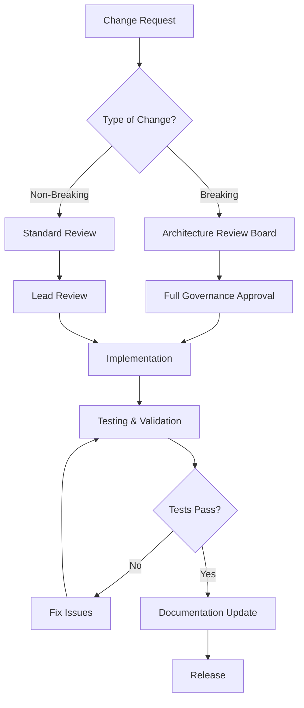

# Design Token Governance

This document establishes governance policies, procedures, and guidelines for managing the KitchenPantry CRM design token system to ensure consistency, maintainability, and quality across all design and development activities.

## Table of Contents

- [Overview](#overview)
- [Governance Structure](#governance-structure)
- [Token Lifecycle Management](#token-lifecycle-management)
- [Change Management Process](#change-management-process)
- [Quality Gates and Validation](#quality-gates-and-validation)
- [Documentation Standards](#documentation-standards)
- [Versioning and Release Process](#versioning-and-release-process)
- [CI/CD Integration](#cicd-integration)
- [Maintenance and Monitoring](#maintenance-and-monitoring)
- [Migration and Deprecation](#migration-and-deprecation)

## Overview

The KitchenPantry CRM design token system is a sophisticated three-tier architecture (primitive → semantic → component) that ensures visual consistency and accessibility compliance across the entire application. This governance framework ensures the system remains maintainable, performant, and aligned with business requirements.

### Design Token Architecture

```
┌─────────────────┐    ┌─────────────────┐    ┌─────────────────┐
│   PRIMITIVE     │    │    SEMANTIC     │    │   COMPONENT     │
│                 │    │                 │    │                 │
│ • MFB Colors    │───▶│ • --primary     │───▶│ • --btn-bg      │
│ • Base Spacing  │    │ • --background  │    │ • --card-shadow │
│ • Typography    │    │ • --success     │    │ • --input-border│
│ • OKLCH Values  │    │ • --text-body   │    │ • --nav-hover   │
└─────────────────┘    └─────────────────┘    └─────────────────┘
```

### Current System Status

- **270+ Design Tokens** across 5 major CSS files
- **WCAG AAA Compliance** with documented contrast ratios
- **MFB Brand Integration** with complete color system
- **Advanced Features** including high contrast, colorblind-friendly alternatives
- **Performance Optimized** with tree-shaking and critical CSS inlining
- **TypeScript Definitions** for enhanced developer experience

## Governance Structure

### Roles and Responsibilities

#### Design Token Steward (Primary Owner)
- **Responsibility**: Overall design token system architecture and strategy
- **Duties**:
  - Approve major architectural changes
  - Maintain design token documentation
  - Ensure WCAG compliance and accessibility standards
  - Coordinate with design and development teams
  - Review and approve token additions/modifications

#### Frontend Development Lead
- **Responsibility**: Technical implementation and integration
- **Duties**:
  - Review technical implementations of design tokens
  - Ensure TypeScript definitions are accurate
  - Maintain build pipeline integrations
  - Review performance impact of token changes

#### Design Lead
- **Responsibility**: Visual consistency and brand compliance
- **Duties**:
  - Approve color palette changes
  - Ensure MFB brand consistency
  - Review visual impact of token modifications
  - Maintain design system coherence

#### Quality Assurance Lead
- **Responsibility**: Testing and validation
- **Duties**:
  - Execute design token test suites
  - Validate accessibility compliance
  - Perform cross-browser and device testing
  - Document testing results and issues

### Decision Authority Matrix

| Change Type | Design Token Steward | Frontend Lead | Design Lead | QA Lead |
|-------------|---------------------|---------------|-------------|----------|
| New primitive tokens | **Approve** | Consult | **Approve** | Validate |
| New semantic tokens | **Approve** | Consult | Consult | Validate |
| Component tokens | Consult | **Approve** | Consult | Validate |
| Color modifications | **Approve** | Consult | **Approve** | **Validate** |
| Performance changes | Consult | **Approve** | Inform | Validate |
| Breaking changes | **Approve** | **Approve** | **Approve** | **Validate** |

## Token Lifecycle Management

### Token States

1. **Proposed** - Initial concept or requirement identified
2. **In Development** - Being implemented and tested
3. **Under Review** - Awaiting approval from governance team
4. **Active** - Live and available for use
5. **Deprecated** - Marked for removal in future version
6. **Retired** - No longer available

### Token Categories and Ownership

#### Primitive Tokens
- **Owner**: Design Token Steward + Design Lead
- **Examples**: `--mfb-green`, `--primary-500`, base spacing values
- **Change Frequency**: Low (quarterly reviews)
- **Impact**: High (affects entire system)

#### Semantic Tokens
- **Owner**: Design Token Steward
- **Examples**: `--primary`, `--background`, `--success`
- **Change Frequency**: Medium (bi-monthly reviews)
- **Impact**: Medium-High (affects multiple components)

#### Component Tokens
- **Owner**: Frontend Development Lead
- **Examples**: `--btn-primary-bg`, `--card-shadow`, `--input-border`
- **Change Frequency**: High (as needed)
- **Impact**: Low-Medium (component-specific)

## Change Management Process

### 1. Change Proposal

All design token changes must follow this process:



### 2. Change Request Template

```markdown
## Design Token Change Request

**Request ID**: DT-YYYY-MM-DD-NNN
**Date**: YYYY-MM-DD
**Requester**: [Name, Role]
**Priority**: [Low/Medium/High/Critical]

### Change Details
- **Token(s) Affected**:
- **Change Type**: [Addition/Modification/Deprecation/Removal]
- **Category**: [Primitive/Semantic/Component]
- **Breaking Change**: [Yes/No]

### Justification
- **Business Requirement**:
- **Design Rationale**:
- **Technical Considerations**:

### Implementation Plan
- **Files to be Modified**:
- **Dependencies**:
- **Timeline**:
- **Testing Requirements**:

### Impact Assessment
- **Components Affected**:
- **Performance Impact**:
- **Accessibility Impact**:
- **Migration Requirements**:

### Approval
- [ ] Design Token Steward
- [ ] Frontend Development Lead
- [ ] Design Lead
- [ ] Quality Assurance Lead
```

### 3. Review Process

#### Standard Review (Non-Breaking Changes)
- **Timeline**: 3-5 business days
- **Reviewers**: Relevant lead + Design Token Steward
- **Requirements**:
  - Impact assessment completed
  - Tests passing
  - Documentation updated

#### Architecture Review (Breaking Changes)
- **Timeline**: 1-2 weeks
- **Reviewers**: Full governance team
- **Requirements**:
  - Migration plan documented
  - Backward compatibility strategy
  - Performance impact analysis
  - Full test suite execution

## Quality Gates and Validation

### Automated Validation Pipeline

All design token changes must pass these automated checks:

#### 1. Syntax and Structure Validation
```bash
# CSS syntax validation
npm run validate:css

# Token structure validation
npm run validate:tokens

# TypeScript compilation
npm run type-check
```

#### 2. Accessibility Compliance
```bash
# WCAG contrast ratio validation
npm run test:accessibility

# Colorblind accessibility check
npm run test:colorblind

# High contrast mode validation
npm run test:high-contrast
```

#### 3. Performance Validation
```bash
# Bundle size analysis
npm run analyze

# Token optimization check
npm run optimize:tokens --dry-run

# Performance impact assessment
npm run test:performance
```

#### 4. Cross-Platform Compatibility
```bash
# Browser compatibility tests
npm run test:browsers

# Mobile responsive validation
npm run test:mobile

# Design tool export validation
npm run test:export
```

### Manual Quality Gates

#### Design Review Checklist
- [ ] Maintains MFB brand consistency
- [ ] Follows established design patterns
- [ ] Preserves visual hierarchy
- [ ] Enhances user experience
- [ ] Compatible with existing components

#### Code Review Checklist
- [ ] Follows naming conventions
- [ ] Maintains three-tier architecture
- [ ] Includes TypeScript definitions
- [ ] Has appropriate documentation
- [ ] Includes test coverage

#### Accessibility Review Checklist
- [ ] Meets WCAG AAA standards
- [ ] Includes high contrast variants
- [ ] Provides colorblind-friendly alternatives
- [ ] Maintains focus visibility
- [ ] Supports screen readers

## Documentation Standards

### Required Documentation for Token Changes

#### 1. Token Definition Documentation
```typescript
/**
 * Token Name: --example-token
 * Category: [primitive|semantic|component]
 * Purpose: Brief description of purpose and usage
 * Values: [light: value, dark: value]
 * Accessibility: WCAG compliance level and contrast ratios
 * Dependencies: List of referenced tokens
 * Components: Components that use this token
 *
 * @example
 * .button-primary {
 *   background-color: var(--example-token);
 * }
 *
 * @see https://design-system-docs/tokens/example-token
 * @since v2.1.0
 * @deprecated Use --new-token instead (v2.3.0)
 */
```

#### 2. Change Log Entry
```markdown
## [Version] - YYYY-MM-DD

### Added
- `--new-token`: Description of new token and usage

### Changed
- `--existing-token`: Description of changes made

### Deprecated
- `--old-token`: Deprecated in favor of --new-token

### Removed
- `--removed-token`: Reason for removal

### Migration Guide
- Instructions for updating code
- Automated migration tools available
```

## Versioning and Release Process

### Semantic Versioning

Design tokens follow semantic versioning (MAJOR.MINOR.PATCH):

- **MAJOR**: Breaking changes that require code updates
- **MINOR**: New tokens or non-breaking enhancements
- **PATCH**: Bug fixes and improvements

### Release Schedule

- **Major Releases**: Quarterly (aligned with product releases)
- **Minor Releases**: Monthly (feature additions)
- **Patch Releases**: As needed (bug fixes)

### Release Process

1. **Pre-Release Validation**
   - All automated tests passing
   - Manual quality gates completed
   - Documentation updated
   - Migration guides prepared

2. **Release Preparation**
   ```bash
   # Generate changelog
   npm run changelog:generate

   # Update version numbers
   npm run version:bump

   # Build optimized tokens
   npm run build:tokens

   # Export cross-platform formats
   npm run export:all-platforms
   ```

3. **Release Deployment**
   - Tag release in version control
   - Deploy to CDN/package registry
   - Update documentation site
   - Notify development teams

4. **Post-Release Monitoring**
   - Monitor for integration issues
   - Track performance metrics
   - Collect feedback from teams
   - Plan next iteration

## CI/CD Integration

### GitHub Actions Workflow

```yaml
name: Design Token Validation

on:
  pull_request:
    paths:
      - 'src/styles/**'
      - 'src/index.css'
      - 'src/lib/design-tokens.ts'

jobs:
  validate-tokens:
    runs-on: ubuntu-latest
    steps:
      - uses: actions/checkout@v3

      - name: Setup Node.js
        uses: actions/setup-node@v3
        with:
          node-version: '18'

      - name: Install Dependencies
        run: npm ci

      - name: Validate Token Syntax
        run: npm run validate:tokens

      - name: Test Accessibility Compliance
        run: npm run test:accessibility

      - name: Check Performance Impact
        run: npm run optimize:tokens --analyze

      - name: Generate Token Report
        run: npm run tokens:report

      - name: Comment PR with Results
        uses: actions/github-script@v6
        with:
          script: |
            // Post validation results as PR comment
```

### Pre-commit Hooks

```bash
#!/bin/sh
# .git/hooks/pre-commit

# Validate design tokens before commit
npm run validate:tokens || exit 1

# Check accessibility compliance
npm run test:accessibility || exit 1

# Ensure TypeScript compilation
npm run type-check || exit 1

echo "✅ Design token validation passed"
```

## Maintenance and Monitoring

### Regular Maintenance Tasks

#### Weekly
- Review token usage analytics
- Monitor performance metrics
- Check for accessibility regressions

#### Monthly
- Update documentation
- Review deprecated token usage
- Analyze bundle size impact
- Update TypeScript definitions

#### Quarterly
- Major architecture review
- Accessibility audit
- Performance optimization
- Cross-platform export updates

### Performance Monitoring

```typescript
// Token performance metrics
interface TokenMetrics {
  bundleSize: number;
  unusedTokens: string[];
  performanceScore: number;
  accessibilityScore: number;
  usageStats: Record<string, number>;
}

// Monitor these KPIs
const KPI_TARGETS = {
  bundleSize: '<50KB',
  unusedTokensPercentage: '<10%',
  performanceScore: '>90',
  accessibilityScore: '100%',
  documentationCoverage: '>95%'
};
```

## Migration and Deprecation

### Deprecation Process

1. **Deprecation Notice** (Version N)
   - Mark token as deprecated in documentation
   - Add TypeScript deprecation warnings
   - Update changelog with migration path

2. **Migration Period** (Version N+1)
   - Provide automated migration tools
   - Support both old and new tokens
   - Monitor usage of deprecated tokens

3. **Removal** (Version N+2)
   - Remove deprecated tokens
   - Update all documentation
   - Verify no remaining usage

### Migration Tools

```bash
# Automated token migration
npm run migrate:tokens --from=v2.0 --to=v2.1

# Generate migration report
npm run migrate:analyze --show-impact

# Validate migration completeness
npm run migrate:validate
```

## Conclusion

This governance framework ensures the KitchenPantry CRM design token system remains:

- **Consistent**: Following established patterns and conventions
- **Maintainable**: Clear ownership and change processes
- **Accessible**: WCAG AAA compliance and inclusive design
- **Performant**: Optimized for production use
- **Scalable**: Supporting future growth and requirements

For questions or clarification on design token governance, contact the Design Token Steward or create an issue in the project repository.

---

**Document Version**: 1.0
**Last Updated**: 2025-01-15
**Next Review**: 2025-04-15
**Owner**: Design Token Steward