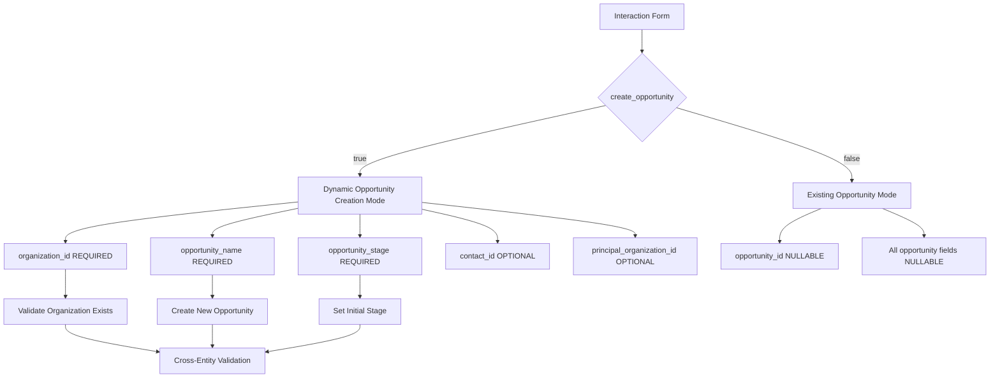

# Interaction Cross-Entity Validation Migration Strategy

## Executive Summary

Interactions represent the most complex validation entity in the CRM system, with the highest dependency chain and most sophisticated cross-entity relationships. This document analyzes the migration strategy from Yup to Zod for interaction validation, focusing on dynamic opportunity creation, priority system integration, and complex conditional validation flows.

## Current System Analysis

### Schema Complexity Overview

The interaction validation system consists of two primary schemas:
1. **`interactionSchema`** - Base interaction validation (141 lines)
2. **`interactionWithOpportunitySchema`** - Dynamic opportunity creation (206 lines)

### Cross-Entity Dependencies

```typescript
// Entity dependency chain (highest in system)
interactions → opportunities → organizations + contacts + principals + products
interactions → contacts → organizations + preferred_principals
interactions → organizations
interactions → priority_system (A+ to D mapping)
interactions → account_managers (Sue, Gary, Dale + extensible)
interactions → multi_principal_support (PrincipalInfo[])
```

### Critical Validation Patterns

#### 1. Dynamic Opportunity Creation
**Pattern**: Conditional schema composition based on `create_opportunity` flag

```typescript
// Current Yup implementation
opportunity_name: yup
  .string()
  .max(255, 'Opportunity name must be 255 characters or less')
  .when('create_opportunity', {
    is: true,
    then: (schema) => schema.required('Opportunity name is required when creating opportunity'),
    otherwise: (schema) => schema.nullable(),
  })
```

**Complexity**: 8 conditional fields that toggle between required and nullable based on boolean flag.

#### 2. Priority System Integration
**Pattern**: Priority levels with UI color mapping and business logic

```typescript
// Priority hierarchy with validation
priority: yup
  .string()
  .oneOf(['A+', 'A', 'B', 'C', 'D'], 'Invalid priority level')
  .nullable()

// UI mapping system
const PRIORITY_COLORS = {
  'A+': { bg: 'bg-destructive/10', text: 'text-destructive', /* ... */ },
  // ... complex color mapping for each priority
}
```

**Complexity**: Tight coupling between validation, business logic, and UI presentation layer.

#### 3. Multi-Principal Support
**Pattern**: Array validation with nested object schemas

```typescript
principals: yup
  .array()
  .of(yup.object({
    id: yup.string().uuid('Invalid principal ID').required(),
    name: yup.string().required('Principal name is required'),
    principal2: yup.string().nullable(), // Up to 4 principals
    principal3: yup.string().nullable(),
    principal4: yup.string().nullable(),
  }))
  .nullable()
```

**Complexity**: Nested object validation within arrays, supporting up to 4 principals per interaction.

#### 4. Follow-up Logic Validation
**Pattern**: Conditional date requirement based on boolean flag

```typescript
follow_up_date: yup
  .string()
  .nullable()
  .when('follow_up_required', {
    is: true,
    then: (schema) => schema.required('Follow-up date is required when follow-up is needed'),
    otherwise: (schema) => schema.nullable(),
  })
```

**Complexity**: Business logic coupling where one field's value determines another field's validation.

## Dynamic Opportunity Creation Analysis

### Pattern Complexity Breakdown

The `interactionWithOpportunitySchema` represents the highest complexity validation pattern in the entire CRM system, with 8 conditional fields that switch between required and nullable based on a single boolean flag:

#### Conditional Field Analysis

```typescript
// Field 1: Organization requirement
organization_id: yup
  .string()
  .uuid('Invalid organization ID')
  .required('Organization is required')  // Always required in this schema

// Field 2: Opportunity name (conditional)
opportunity_name: yup
  .string()
  .max(255, 'Opportunity name must be 255 characters or less')
  .when('create_opportunity', {
    is: true,
    then: (schema) => schema.required('Opportunity name is required when creating opportunity'),
    otherwise: (schema) => schema.nullable(),
  })

// Field 3: Opportunity stage (conditional with enum validation)
opportunity_stage: yup
  .string()
  .oneOf([
    'New Lead', 'Initial Outreach', 'Sample/Visit Offered',
    'Awaiting Response', 'Feedback Logged', 'Demo Scheduled', 'Closed - Won'
  ], 'Invalid opportunity stage')
  .when('create_opportunity', {
    is: true,
    then: (schema) => schema.required('Opportunity stage is required when creating opportunity'),
    otherwise: (schema) => schema.nullable(),
  })

// Fields 4-8: Additional conditional fields
principal_organization_id: yup.string().uuid().nullable() // Optional in both modes
opportunity_context: yup.string().oneOf([...contexts]).nullable() // Optional in both modes
```

### Validation Flow Dependencies



### Business Logic Integration

The dynamic opportunity creation involves complex business rules:

1. **Auto-naming Logic**: When creating opportunities through interactions, names are auto-generated based on organization, principal, and interaction context
2. **Stage Validation**: New opportunities must start with valid initial stages from the opportunity pipeline
3. **Principal Relationships**: Optional principal assignment that affects opportunity categorization
4. **Contact Association**: Links interaction contact to the created opportunity if provided

## Priority System Integration Analysis

### Current Priority Architecture

```typescript
// Priority definition with strict ordering
export type InteractionPriority = 'A+' | 'A' | 'B' | 'C' | 'D'

// UI integration with semantic tokens
export const PRIORITY_COLORS = {
  'A+': {
    bg: 'bg-destructive/10',
    text: 'text-destructive',
    border: 'border-destructive/20',
    badge: 'bg-destructive text-destructive-foreground',
  },
  // ... complete color mapping for all priorities
}

// Business logic templates with default priorities
export const MOBILE_INTERACTION_TEMPLATES = [
  {
    type: 'in_person' as InteractionType,
    subject: 'In-person meeting',
    defaultNotes: 'Met with key decision makers to discuss opportunities',
    priority: 'A' as InteractionPriority, // High priority for face-to-face
  },
  {
    type: 'quoted' as InteractionType,
    subject: 'Quote provided',
    defaultNotes: 'Provided pricing quote for requested products',
    priority: 'A' as InteractionPriority, // High priority for sales activity
  },
  // ... 7 total templates with business-logic-driven priority assignment
]
```

### Priority System Dependencies

1. **Validation Layer**: Enum validation with specific string values
2. **UI Layer**: Color mapping with shadcn/ui semantic tokens
3. **Business Logic Layer**: Template system with default priority assignment
4. **Data Layer**: Database storage as string enum with constraint validation

### Zod Migration Challenges

#### 1. Enum Validation Consistency
```typescript
// Current Yup implementation
priority: yup
  .string()
  .oneOf(['A+', 'A', 'B', 'C', 'D'], 'Invalid priority level')
  .nullable()

// Proposed Zod implementation
const prioritySchema = z.enum(['A+', 'A', 'B', 'C', 'D'], {
  errorMap: () => ({ message: 'Invalid priority level' })
}).nullable()
```

#### 2. Type Safety Integration
Current system has loose coupling between validation and UI/business logic. Zod migration provides opportunity to strengthen type relationships:

```typescript
// Enhanced type safety with Zod
const InteractionPriorityZod = z.enum(['A+', 'A', 'B', 'C', 'D'])
type InteractionPriorityZodType = z.infer<typeof InteractionPriorityZod>

// Compile-time verification of color mapping keys
const PRIORITY_COLORS_ZOD: Record<InteractionPriorityZodType, ColorConfig> = {
  // TypeScript will enforce all enum values are present
}
```

## Conditional Follow-up Logic Analysis

### Current Implementation Pattern

```typescript
// Two-field conditional validation
follow_up_required: yup.boolean().default(false),

follow_up_date: yup
  .string()
  .nullable()
  .when('follow_up_required', {
    is: true,
    then: (schema) => schema.required('Follow-up date is required when follow-up is needed'),
    otherwise: (schema) => schema.nullable(),
  }),

// Additional follow-up context
follow_up_notes: yup
  .string()
  .max(500, 'Follow-up notes must be 500 characters or less')
  .nullable(),
```

### Business Logic Context

The follow-up system represents core CRM workflow:
1. **Flag Setting**: User indicates follow-up is needed
2. **Date Requirement**: System enforces date selection when flag is true
3. **Note Addition**: Optional context for follow-up planning
4. **Workflow Integration**: Follow-ups appear in task management and notifications

### Zod Migration Pattern Options

#### Option 1: Cross-field Refinement (Recommended)
```typescript
const followUpLogicSchema = z.object({
  follow_up_required: z.boolean().default(false),
  follow_up_date: z.string().nullable(),
  follow_up_notes: z.string().max(500).nullable(),
}).refine(
  (data) => {
    // If follow-up is required, date must be provided
    if (data.follow_up_required && !data.follow_up_date) {
      return false
    }
    return true
  },
  {
    message: 'Follow-up date is required when follow-up is needed',
    path: ['follow_up_date'] // Points to specific field for UI error display
  }
)
```

#### Option 2: Discriminated Union Approach
```typescript
const followUpLogicSchema = z.discriminatedUnion('follow_up_required', [
  // No follow-up mode
  z.object({
    follow_up_required: z.literal(false),
    follow_up_date: z.string().nullable(),
    follow_up_notes: z.string().max(500).nullable(),
  }),

  // Follow-up required mode
  z.object({
    follow_up_required: z.literal(true),
    follow_up_date: z.string().min(1, 'Follow-up date is required when follow-up is needed'),
    follow_up_notes: z.string().max(500).nullable(),
  }),
])
```

**Recommendation**: Option 1 (refinement) maintains simpler schema structure while providing identical validation behavior to current Yup implementation.

## Zod Migration Strategy

### Phase 1: Base Schema Migration

#### 1.1 Core Field Validation
**Zod Implementation**: Direct enum and string validation mapping

```typescript
// Recommended Zod pattern
const interactionTypeSchema = z.enum([
  'call', 'email', 'meeting', 'demo', 'proposal', 'follow_up',
  'trade_show', 'site_visit', 'contract_review', 'in_person',
  'quoted', 'distribution'
], {
  errorMap: () => ({ message: 'Invalid interaction type' })
})

const prioritySchema = z.enum(['A+', 'A', 'B', 'C', 'D'], {
  errorMap: () => ({ message: 'Invalid priority level' })
}).nullable()
```

**Risk Level**: LOW - Direct mapping with improved type safety

#### 1.2 Transform System Integration
**Challenge**: 15+ FormTransforms functions heavily used throughout schema

**Zod Solution**: Custom transform functions with `.transform()`

```typescript
// Zod-compatible transforms
const interactionZodSchema = z.object({
  location: z.string()
    .max(255, 'Location must be 255 characters or less')
    .nullable()
    .transform(ZodTransforms.nullableString), // New transform utility

  contact_id: z.string()
    .uuid('Invalid contact ID')
    .nullable()
    .transform(ZodTransforms.uuidField),
})
```

**Risk Level**: MEDIUM - Requires new ZodTransforms utility implementation

### Phase 2: Conditional Logic Migration

#### 2.1 Follow-up Logic Pattern
**Zod Implementation**: Using `.refine()` for cross-field validation

```typescript
const baseInteractionSchema = z.object({
  follow_up_required: z.boolean().default(false),
  follow_up_date: z.string().nullable(),
}).refine(
  (data) => {
    if (data.follow_up_required && !data.follow_up_date) {
      return false
    }
    return true
  },
  {
    message: 'Follow-up date is required when follow-up is needed',
    path: ['follow_up_date']
  }
)
```

**Risk Level**: MEDIUM - Different pattern from Yup's `.when()`, requires comprehensive testing

#### 2.2 Multi-Principal Validation
**Zod Implementation**: Array schemas with nested object validation

```typescript
const principalInfoSchema = z.object({
  id: z.string().uuid('Invalid principal ID'),
  name: z.string().min(1, 'Principal name is required'),
  principal2: z.string().nullable().optional(),
  principal3: z.string().nullable().optional(),
  principal4: z.string().nullable().optional(),
})

const principalsArraySchema = z.array(principalInfoSchema)
  .nullable()
  .optional()
```

**Risk Level**: LOW-MEDIUM - Straightforward mapping with better type inference

### Phase 3: Dynamic Opportunity Creation

#### 3.1 Discriminated Union Approach
**Zod Implementation**: Using discriminated unions for mode switching

```typescript
const interactionWithOpportunitySchema = z.discriminatedUnion('create_opportunity', [
  // Mode: Using existing opportunity
  z.object({
    create_opportunity: z.literal(false),
    opportunity_id: z.string().uuid('Invalid opportunity ID').nullable(),
    // Opportunity creation fields are not required
    opportunity_name: z.string().nullable().optional(),
    opportunity_stage: z.string().nullable().optional(),
    // ... other optional fields
  }),

  // Mode: Creating new opportunity
  z.object({
    create_opportunity: z.literal(true),
    opportunity_id: z.string().uuid('Invalid opportunity ID').nullable(),
    // Opportunity creation fields become required
    organization_id: z.string().uuid('Invalid organization ID'),
    opportunity_name: z.string()
      .max(255, 'Opportunity name must be 255 characters or less'),
    opportunity_stage: z.enum([
      'New Lead', 'Initial Outreach', 'Sample/Visit Offered',
      'Awaiting Response', 'Feedback Logged', 'Demo Scheduled',
      'Closed - Won'
    ]),
    // ... other required fields
  })
])
```

**Risk Level**: HIGH - Complex schema composition requiring extensive testing

#### 3.2 Schema Composition Pattern
**Alternative Zod Implementation**: Using `.extend()` and `.merge()`

```typescript
// Base interaction schema
const baseInteractionSchema = z.object({
  // ... base fields
})

// Opportunity creation extension
const opportunityCreationSchema = z.object({
  create_opportunity: z.boolean().default(false),
  opportunity_name: z.string().nullable(),
  opportunity_stage: z.string().nullable(),
  // ... other opportunity fields
})

// Combined schema with conditional validation
const interactionWithOpportunitySchema = baseInteractionSchema
  .merge(opportunityCreationSchema)
  .refine(
    (data) => {
      if (data.create_opportunity) {
        return !!(data.opportunity_name && data.opportunity_stage)
      }
      return true
    },
    {
      message: 'Opportunity fields required when creating opportunity',
      path: ['opportunity_name']
    }
  )
```

**Risk Level**: MEDIUM-HIGH - Less type-safe than discriminated unions but more familiar

## Implementation Roadmap

### Stage 1: Infrastructure Preparation (Risk: LOW)
**Timeline**: 2-3 days

1. **Create ZodTransforms utility**
   - Port all FormTransforms functions to Zod-compatible versions
   - Maintain identical behavior for consistency
   - Add comprehensive unit tests

2. **Implement base schema components**
   - Priority system schema
   - Interaction type enum schema
   - Account manager schema
   - Multi-principal support schema

3. **Create validation constants**
   - Maximum lengths and constraints
   - Enum value definitions
   - Error message templates

### Stage 2: Base Schema Migration (Risk: MEDIUM)
**Timeline**: 3-4 days

1. **Migrate `interactionSchema`**
   - Direct field mapping from Yup to Zod
   - Integrate ZodTransforms for nullable fields
   - Implement follow-up logic using `.refine()`
   - Create comprehensive validation tests

2. **Type inference validation**
   - Ensure `InteractionZodFormData` matches `InteractionFormData`
   - Validate all transform behaviors
   - Test React Hook Form integration

3. **Performance benchmarking**
   - Compare validation performance vs Yup
   - Identify optimization opportunities
   - Document performance characteristics

### Stage 3: Dynamic Opportunity Creation (Risk: HIGH)
**Timeline**: 5-7 days

1. **Schema architecture decision**
   - Evaluate discriminated union vs schema composition
   - Prototype both approaches
   - Choose based on type safety and maintainability

2. **Implement chosen pattern**
   - Migrate `interactionWithOpportunitySchema`
   - Handle all 8 conditional fields
   - Maintain exact validation behavior

3. **Integration testing**
   - Test dynamic opportunity creation flow
   - Validate cross-entity relationships
   - Ensure database constraint compliance

### Stage 4: Form Integration & Testing (Risk: MEDIUM)
**Timeline**: 3-4 days

1. **Update form components**
   - Modify form setup hooks
   - Update resolver detection logic
   - Ensure backward compatibility

2. **Comprehensive validation testing**
   - Cross-entity validation scenarios
   - Error message consistency
   - UI integration testing

3. **Performance validation**
   - Form validation speed
   - Bundle size impact
   - Memory usage analysis

## Risk Assessment & Mitigation

### High-Risk Areas

#### 1. Dynamic Opportunity Creation
**Risk**: Complex conditional validation may not map 1:1 from Yup to Zod

**Mitigation Strategies**:
- Implement both discriminated union and schema composition approaches
- Create comprehensive test suite covering all conditional branches
- Maintain dual validation during migration for comparison
- Rollback plan to Yup if validation behavior differs

#### 2. Transform System Dependencies
**Risk**: 15+ transform functions need exact behavior preservation

**Mitigation Strategies**:
- Create unit tests for each transform function
- Run parallel Yup/Zod validation during development
- Implement validation parity testing framework
- Document any behavioral differences

#### 3. Cross-Entity Validation Flow
**Risk**: Interaction → Opportunity → Organization/Contact dependency chain

**Mitigation Strategies**:
- Implement in phases with isolated testing
- Create integration test scenarios
- Validate database constraint compliance
- Test rollback procedures

### Medium-Risk Areas

#### 1. Priority System Integration
**Risk**: UI coupling with validation logic

**Mitigation Strategies**:
- Maintain existing PRIORITY_COLORS mapping
- Test UI component integration
- Validate business logic preservation

#### 2. Multi-Principal Support
**Risk**: Array validation with nested objects

**Mitigation Strategies**:
- Create focused unit tests
- Test array manipulation scenarios
- Validate type inference accuracy

### Low-Risk Areas

#### 1. Basic Field Validation
**Risk**: Standard enum and string validation

**Mitigation**: Direct mapping with standard testing

#### 2. Account Manager System
**Risk**: Simple string array validation

**Mitigation**: Straightforward enum conversion

## Testing Strategy

### Unit Testing Framework

#### 1. Validation Parity Tests
```typescript
describe('Interaction Validation Parity', () => {
  testValidationParity({
    yupSchema: interactionSchema,
    zodSchema: interactionZodSchema,
    testCases: [
      // Valid interactions
      { /* complete interaction data */ },
      // Invalid interactions
      { /* various invalid scenarios */ },
      // Edge cases
      { /* boundary conditions */ }
    ]
  })
})
```

#### 2. Transform Function Tests
```typescript
describe('ZodTransforms', () => {
  it('should match FormTransforms.nullableString behavior', () => {
    const testCases = [null, undefined, '', '  ', 'valid']
    testCases.forEach(input => {
      expect(ZodTransforms.nullableString(input))
        .toEqual(FormTransforms.nullableString(input))
    })
  })
})
```

#### 3. Cross-Entity Integration Tests
```typescript
describe('Interaction Cross-Entity Validation', () => {
  it('should validate opportunity creation flow', async () => {
    // Test dynamic opportunity creation
    // Test organization requirements
    // Test contact relationships
  })

  it('should validate multi-principal scenarios', async () => {
    // Test principal array validation
    // Test nested object validation
  })
})
```

### Integration Testing

#### 1. Form Integration Tests
- React Hook Form resolver compatibility
- Error message display consistency
- Field validation timing
- Form submission behavior

#### 2. Database Integration Tests
- Cross-entity relationship validation
- Soft delete compliance
- UUID consistency checks
- Referential integrity maintenance

#### 3. Performance Testing
- Validation speed benchmarks
- Memory usage profiling
- Bundle size impact analysis
- Render performance effects

## Migration Checklist

### Pre-Migration
- [ ] Complete ZodTransforms utility implementation
- [ ] Create validation parity testing framework
- [ ] Implement base schema components (priority, types, etc.)
- [ ] Set up performance benchmarking tools

### Migration Phase 1: Base Schema
- [ ] Migrate basic field validation
- [ ] Implement follow-up logic using `.refine()`
- [ ] Add multi-principal array validation
- [ ] Create type inference tests
- [ ] Validate form integration

### Migration Phase 2: Dynamic Opportunity Creation
- [ ] Choose schema architecture (discriminated union vs composition)
- [ ] Implement complex conditional validation
- [ ] Test all 8 conditional fields
- [ ] Validate cross-entity relationships
- [ ] Performance test complex schemas

### Migration Phase 3: Integration & Testing
- [ ] Update form components and hooks
- [ ] Run comprehensive validation tests
- [ ] Validate UI integration
- [ ] Performance benchmark comparison
- [ ] Document migration results

### Post-Migration
- [ ] Remove dual validation system
- [ ] Clean up temporary migration code
- [ ] Update developer documentation
- [ ] Create troubleshooting guide

## Success Criteria

### Functional Requirements
1. **Validation Parity**: 100% identical validation behavior between Yup and Zod schemas
2. **Type Safety**: Improved TypeScript inference with no `any` types
3. **Performance**: Validation speed ≥ current Yup performance
4. **Integration**: Seamless React Hook Form integration

### Technical Requirements
1. **Bundle Size**: No significant increase in bundle size
2. **Memory Usage**: No memory leaks or excessive allocation
3. **Error Messages**: Consistent error message formatting
4. **Rollback**: Immediate rollback capability if issues arise

### Quality Requirements
1. **Test Coverage**: ≥95% test coverage for interaction validation
2. **Documentation**: Complete migration documentation
3. **Developer Experience**: Improved DX with better IDE support
4. **Maintainability**: Cleaner schema composition patterns

## Conclusion

The interaction validation migration represents the most complex challenge in the Yup-to-Zod migration project. The dynamic opportunity creation feature, combined with extensive cross-entity relationships and conditional validation logic, requires careful planning and phased implementation.

The recommended approach prioritizes safety through comprehensive testing, gradual migration with dual validation systems, and immediate rollback capabilities. The discriminated union pattern for dynamic opportunity creation offers the best type safety, while the ZodTransforms utility ensures behavioral consistency.

Success depends on meticulous testing of conditional validation scenarios, particularly the 8-field dynamic opportunity creation logic and the complex cross-entity relationship validation flows. The implementation roadmap provides a structured approach to minimize risk while maximizing the benefits of improved type safety and developer experience.